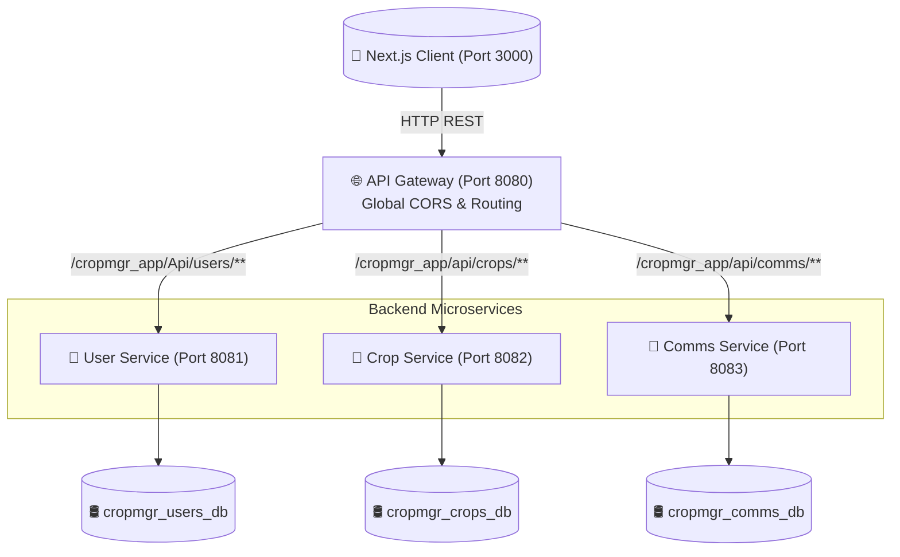

<div align="center">
  
  <h1>🌱 CropAssist Enterprise</h1>
  <p><strong>Next-Generation Agricultural Management & Communication Platform</strong></p>

  <p>
    
    
    
    
    
  </p>
</div>

---

## 📖 Introduction

**CropAssist** is an enterprise-grade web application designed to bridge the gap between agricultural managers and farmers. Engineered with a highly scalable **Microservices Architecture**, CropAssist enables real-time crop tracking, secure credential management, and seamless two-way communication to optimize yield outputs and farming operations.

Featuring a gorgeous, 3D-accelerated user interface powered by **Next.js** and **Framer Motion**, CropAssist guarantees an unparalleled user experience in both light and dark modes.

---

## 🏗️ Architecture Topology

CropAssist utilizes an API Gateway pattern to route front-end requests seamlessly to decentralized, independently scalable backend domains.



---

## ✨ Core Features

| Module | Features & Capabilities |
| :--- | :--- |
| **User Service** | Secure BCrypt password hashing, Farmer/Manager role segregation, National Identity Card (NIC) validations. |
| **Crop Service** | Real-time yield tracking, harvest estimations, active health monitoring, status lifecycles. |
| **Comms Service** | Instant chat relay between Farmers & Managers, localized dashboard notifications, read receipts. |
| **Frontend UI** | iOS-style 3D dropdowns, dynamic derived state notifications, intelligent search & filtering, fully responsive. |

---

## 🚀 Setup & Installation Guide

Follow these steps precisely to initialize the enterprise environment on your local development machine.

### 1️⃣ Prerequisites
- **Java 17 (JDK 17)** or higher
- **Node.js 20+** and `npm`
- **MySQL 5.7+** Database Server
- **Maven 3.9+**

### 2️⃣ Database Initialization
Ensure your local MySQL instance is running on port `3306` with root credentials (`root`/`root`). Run the following commands to provision the isolated databases:

```sql
CREATE DATABASE cropmgr_users_db;
CREATE DATABASE cropmgr_crops_db;
CREATE DATABASE cropmgr_comms_db;
```
> *Hibernate's `ddl-auto=update` configuration will automatically generate the required tables upon application startup.*

### 3️⃣ Bootstrapping the Backend
The backend utilizes Maven's multi-module architecture. You must start the API gateway and the microservices individually or via the parent POM (if configured).

1. Navigate to the project root.
2. Compile the entire ecosystem:
   ```bash
   mvn clean compile
   ```
3. Boot up the microservices (ideally in separate terminal windows or via IntelliJ IDEA Run Dashboard):
   - **API Gateway:** `cd api-gateway && mvn spring-boot:run`
   - **User Service:** `cd user-service && mvn spring-boot:run`
   - **Crop Service:** `cd crop-service && mvn spring-boot:run`
   - **Comms Service:** `cd comms-service && mvn spring-boot:run`

### 4️⃣ Bootstrapping the Frontend
The Next.js client requires dependencies to be resolved before spinning up the development server.

```bash
cd frontend
npm install
npm run dev
```
Navigate to `http://localhost:3000` to access the application.

---

## 🛡️ Best Practices & Safety Tips

> [!CAUTION]
> **Database Passwords:** The system currently defaults to `root`/`root` for MySQL. Before deploying to production, inject these via Environment Variables (`${DB_PASSWORD}`) instead of hardcoding them in `application.properties`.

> [!WARNING]
> **API Gateway Integrity:** Do **NOT** bypass the API Gateway by hitting ports `8081`, `8082`, or `8083` directly from the frontend. Cross-Origin Resource Sharing (CORS) is strictly enforced at the Gateway (`8080`) level.

> [!TIP]
> **Frontend Routing:** When building new React components, ensure all `fetch()` calls route through `http://localhost:8080/cropmgr_app/...` to maintain strict microservice compliance.

---

## 👥 Contributors & Core Team

CropAssist is proudly built and maintained by the following engineers:

- 👨‍💻 **[Dulan](https://github.com/DulanDhanush)**
- 👨‍💻 **[Nimna](https://github.com/NimnaOfficial)** 
- 👨‍💻 **[Huwin](https://github.com/Huwinfenando)**
- 👨‍💻 **[Vidura](https://github.com/ushanp02-maker)**

---

<div align="center">
  <h2>⚖️ Legal & Licensing</h2>
  
  <blockquote>
    <b>🌍 OPEN SOURCE SOFTWARE 🌍</b><br/>
    This software is open source and available under the <b>MIT License</b>. <br/>
    You are free to copy, modify, distribute, and use this project for personal or commercial purposes. We believe in the power of open-source collaboration!<br/> 
    Please refer to the <code>LICENSE</code> file in the root directory for the full terms.
  </blockquote>
</div>

---
*Built with ❤️ for the Future of Smart Agriculture.*